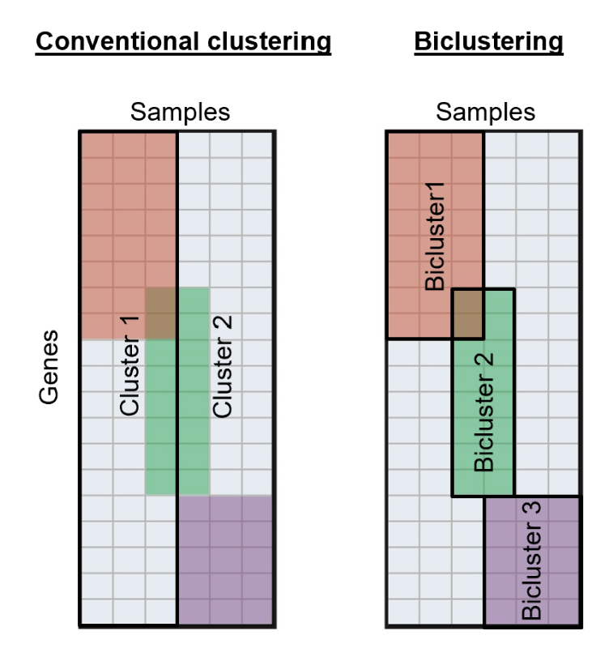
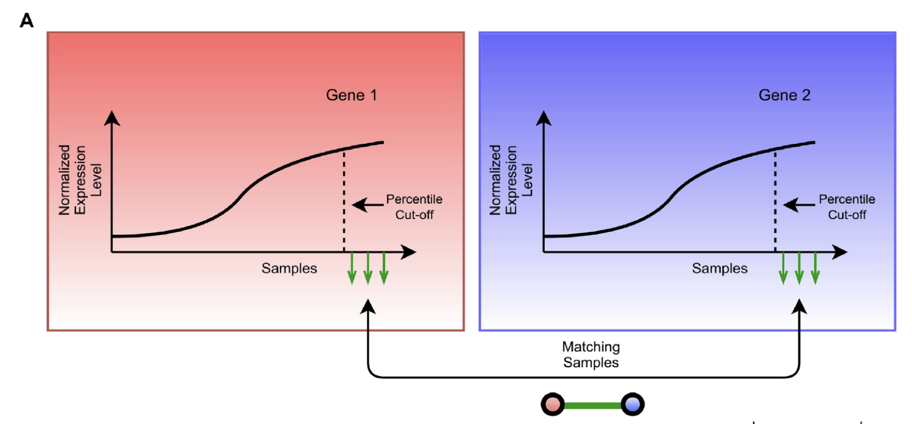

## Pan-Cancer TuBA Database

 This is an online resource that visualizes results of the TuBA (tunable biclustering) algorithm for 22 cancer types. It offers Kaplan-meier survival plots and bar graphs of copy number number distribution across chromosomes for each bicluster in each cancer. More importantly, this application allows the filtering of biclusters based on genes, biological pathways (gene ontology terms), significance of survival, chromosome locations, and copy number enrichment. 

### The Tunable Biclustering Algorithm (TuBA)

 &nbsp; 
  
 Biclustering is clustering based on co-expressed genes by a subset of samples. Compared to conventional clustering, this allows us to analyze gene enrichment and molecular and clinical associations at the same time (Fig. 1).
For each gene, we take the top 5% of samples with the highest expression level. Then we match samples between each pair of genes to create the bicluster (Fig. 2). 

### “Biological Pathways” Page

 The "Select the bicluster of interest" input is adjusted dynamically based on the selected gene and biological pathway of interest. Users can also choose to filter by significance of biological pathway and survival analysis.

In the "Gene Information"" tab, a table of gene information including gene names and chromosome is provided. A vector of all the genes and samples in the bicluster is also provided at the bottom of the page.

In the "Biological Pathway Information" tab, a table of biological pathways and its significance is provided. 

### "Copy Number" Page

 The "Select the bicluster of interest" input is adjusted dynamically based on the chromosome of interest. It provides a filtered list of biclusters where more than 80% of its genes belong in the selected chromosome of interest. The gene information table and vector of genes and samples are provided as well. 

If wish to compare the survival curve and copy number enrichment of a bicluster, or compare different cancer types, another website tab can be opened for comparison. 

### Credits

 This project was developed by [Connie Zhang](https://connie-zhang.github.io) while she was an intern at the [Khiabanian Lab](http://www.khiabanian-lab.org), as a part of the Rutgers University DIMACS REU program. Amartya Singh, is a postdoc in our lab, developed the [TuBA algorithm](https://doi.org/10.1093/gigascience/giz064) and provided useful input in how to employ the algorithm results for data analysis. 

The plotting design is developed using the ggplot2 package. The TCGA expression data were downloaded from the [USCS Xena portal](https://xenabrowser.net/datapages/). 

Authors:
- Connie Zhang
- Amartya Singh
- Hossein Khiabanian 
